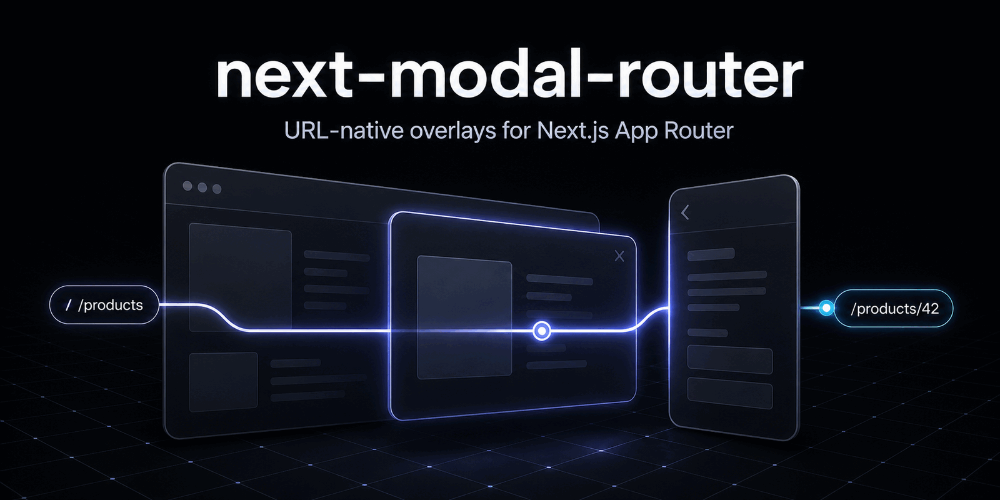

# next-modal-router

> URL-native modals, drawers and overlays for Next.js App Router — without the routing headache.



[GitHub Repository](https://github.com/RanjbarAli/next-modal-router) · [npm package](https://www.npmjs.com/package/next-modal-router) *(first release not published yet)*

[](https://www.npmjs.com/package/next-modal-router)
[](https://www.npmjs.com/package/next-modal-router)
[](https://github.com/RanjbarAli/next-modal-router/actions/workflows/ci.yml)
[](./LICENSE)

`next-modal-router` supplies the small runtime and the route tooling needed to build overlays with Next.js Parallel Routes and Intercepting Routes. It does not replace the App Router and it does not render a dialog design system.

## Why?

The native model is excellent: navigate softly from `/products` to `/products/42`, show the product over the list, retain the real URL, and render a full page when that URL is loaded directly. The awkward part is maintaining infrastructure such as:

```text
app/@modal/(.)products/[id]/page.tsx
```

along with `default.tsx`, the full-page counterpart, the correct interception depth, safe closing, and nested browser history. This package turns that work into:

```bash
npx next-modal-router init --yes
npx next-modal-router add product \
  --route "/products/[id]" \
  --source "/products" \
  --type modal \
  --fallback "/products"
```

## Features

- URL-native, refresh-safe routes built on the App Router
- Safe close behavior with an explicit fallback for direct entries
- Typed `OverlayLink`, navigation hook, state hook, and query helpers
- Intercepting-route generation with route-segment-aware calculations
- Config-driven validation and zero-config filesystem discovery
- Logical nested depth backed by URL navigation—not a detached SPA stack
- Headless modal, drawer, sheet, panel, or custom semantics
- CI-friendly JSON output, deterministic exit codes, dry runs, and `--cwd`
- Small ESM runtime with no UI dependency

## Installation

```bash
pnpm add next-modal-router
```

```bash
npm install next-modal-router
```

Next.js 14.2–16 and React 18.2–19 are peer dependencies.

## Quick start

Initialize the config and default slot:

```bash
npx next-modal-router init --yes
```

Generate a product overlay:

```bash
npx next-modal-router add product \
  --route "/products/[id]" \
  --source "/products" \
  --slot modal \
  --type modal \
  --fallback "/products"
```

The command reports every write and creates a compilable starting point:

```text
app/
├── @modal/
│   ├── default.tsx
│   └── (.)products/
│       └── [id]/
│           └── page.tsx
└── products/
    └── [id]/
        └── page.tsx
```

Wire the slot and provider into the layout that owns `@modal`:

```tsx
import { Suspense, type ReactNode } from "react"
import { OverlayRouterProvider } from "next-modal-router"

export default function Layout({
  children,
  modal,
}: {
  children: ReactNode
  modal: ReactNode
}) {
  return (
    <OverlayRouterProvider>
      {children}
      <Suspense fallback={null}>{modal}</Suspense>
    </OverlayRouterProvider>
  )
}
```

Link to the real route:

```tsx
import { OverlayLink } from "next-modal-router"

<OverlayLink href="/products/42" fallback="/products" scroll={false}>
  View product
</OverlayLink>
```

Use your preferred dialog UI in the intercepted page and close it safely:

```tsx
"use client"

import { useOverlayRouter } from "next-modal-router"

export default function ProductModal() {
  const overlay = useOverlayRouter()

  return (
    <section role="dialog" aria-modal="true" aria-labelledby="product-title">
      <h2 id="product-title">Product 42</h2>
      <button onClick={() => overlay.close()}>Close</button>
    </section>
  )
}
```

A click from `/products` shows an overlay at `/products/42`. Loading or refreshing `/products/42` renders `app/products/[id]/page.tsx` as a normal page.

## URL-native overlays

An overlay is always a route. `OverlayLink` delegates navigation to Next.js `Link`; `useOverlayRouter` delegates to `useRouter`; and the generated folders use the official `@slot` and interception conventions. Bookmarks, sharing, reloads, and server rendering therefore retain native behavior.

Use an overlay when the destination deserves a URL. For transient confirmations or menus with no meaningful destination, a regular local-state component is a better fit.

## Soft navigation versus direct navigation

| Entry | Next.js result | Package state |
| --- | --- | --- |
| Click `/products` → `/products/42` | Intercepted slot route | depth `1`, safe back recorded |
| Paste or refresh `/products/42` | Full-page route | depth `0`, close uses fallback |
| Back/forward | Native history traversal | App Router decides rendered route |

Interception is a Next.js soft-navigation behavior. This package deliberately does not force an intercepted UI on hard navigation.

## Safe close behavior

Calling `router.back()` blindly can send a direct visitor back to another website. The provider records only overlay navigation initiated by `OverlayLink` or `overlay.open()` during the current application lifetime.

- A recorded current overlay closes with `router.back()`.
- A direct load, missing marker, or uncertain state closes with `router.replace(fallback)`.
- If no fallback exists, the conservative default is `/`.

```tsx
<OverlayLink href="/products/42" fallback="/products">
  View product
</OverlayLink>
```

The browser does not expose arbitrary history entries, so this is intentionally a safe heuristic rather than a claim of perfect history knowledge. Configure `closeFallback` and pass `fallback` when the direct-entry close destination matters.

## Modal routing

Set `type: "modal"` for documentation and tooling semantics. The intercepted page controls the actual markup:

```ts
product: {
  route: "/products/[id]",
  source: "/products",
  type: "modal",
  slot: "modal",
  closeFallback: "/products",
}
```

The type never injects styles, portals, focus traps, or animation.

## Drawer, sheet, and panel routing

Drawers and sheets use exactly the same routing mechanism. A separate slot is useful when two overlay surfaces should be independent:

```ts
notifications: {
  route: "/notifications",
  source: "/dashboard",
  type: "drawer",
  slot: "panel",
  closeFallback: "/dashboard",
}
```

Render the intercepted `@panel/(.)notifications/page.tsx` with your own sheet or drawer component.

## Nested overlays

Each call to `overlay.open()` or click on `OverlayLink` records one logical level:

```text
/products → /products/42 → /products/42/reviews
depth 0       depth 1              depth 2
```

```tsx
<OverlayLink href={`/products/${id}/reviews`} fallback={`/products/${id}`}>
  Reviews
</OverlayLink>
```

`overlay.close()` traverses one native history entry when that level was recorded safely. The actual visual composition still follows Next.js slot rendering: use another parallel slot or render the parent shell in the nested intercepted route when both layers must remain visible.

See [Nested overlays](./docs/nested-overlays.md).

## Browser back and forward

`overlay.back()` and `overlay.forward()` are direct App Router operations. Browser buttons work normally because the URL and Next.js history remain authoritative. The package does not patch `pushState`, attach a global popstate router, or keep a competing route store.

## Query parameter helpers

Update a subset of parameters without discarding the rest:

```tsx
const overlay = useOverlayRouter()

overlay.setSearchParams({ tab: "reviews" })
// /products/42?tab=reviews

overlay.setSearchParams({ tab: "details", sort: "newest" })
// /products/42?sort=newest&tab=details

overlay.setSearchParams({ tab: null })
// removes tab and preserves sort
```

The standalone pure helper is useful outside React:

```ts
import { updateSearchParams } from "next-modal-router"

const next = updateSearchParams("tab=details&sort=newest", { tab: "reviews" })
```

Updates use `router.replace()` and preserve Next.js navigation semantics.

## Scroll behavior

`OverlayLink` defaults `scroll` to `false`, which is normally appropriate for preserving the underlying page position. Override it with the standard Next.js prop when the destination should scroll:

```tsx
<OverlayLink href="/products/42" scroll>
  View product
</OverlayLink>
```

The package adds no scroll restoration hacks.

## Focus restoration

The provider records the focused trigger for internal overlay navigation and focuses it after close when it remains connected. This lightweight behavior is enabled by default and interoperates with dialog libraries:

```tsx
<OverlayRouterProvider restoreFocus={false}>
  {children}
  {modal}
</OverlayRouterProvider>
```

Disable it when your UI library owns focus restoration. Focus trapping and initial modal focus remain the responsibility of that accessible dialog implementation.

## Route generation

`add` models URL segments separately from filesystem segments, ignores route groups for interception depth, validates route inputs against traversal, and emits atomic writes. Existing full-page routes and slot defaults are preserved; conflicting intercepted pages require `--force`.

```bash
npx next-modal-router add reviews \
  --route "/products/[id]/reviews" \
  --source "/products/[id]" \
  --type drawer \
  --slot modal \
  --fallback "/products/[id]" \
  --dry-run
```

## Route validation

`check` verifies slot defaults, configured interceptors, full-page counterparts, and fallback pages. Diagnostics use stable codes:

| Code | Meaning |
| --- | --- |
| `NMR001` | Missing slot `default` route |
| `NMR002` | Missing configured interceptor |
| `NMR003` | Incorrect interception path |
| `NMR004` | Missing full-page counterpart |
| `NMR005` | Missing close fallback page |
| `NMR006` | Discovered overlay absent from config |

## Zero-config discovery

`check` and `list` still scan existing `@slot` directories when no config exists. For example, `app/@modal/(.)photos/[id]/page.tsx` appears as a discovered overlay. Add a config when you want source, fallback, and expected-target validation.

## Config-driven workflows

Configuration is the explicit contract used by generation and CI. It does not ship to the browser and is not required by the runtime.

```ts
import { defineConfig } from "next-modal-router/config"

export default defineConfig({
  defaultSlot: "modal",
  overlays: {
    product: {
      route: "/products/[id]",
      source: "/products",
      type: "modal",
      slot: "modal",
      closeFallback: "/products",
    },
  },
})
```

See [Configuration](./docs/configuration.md).

## CLI usage

### `init`

Detects a Next.js App Router project and TypeScript, then creates the config and default slot fallback.

```bash
next-modal-router init [--slot modal] [--yes] [--dry-run] [--force]
```

```text
CREATE next-modal-router.config.ts
CREATE app/@modal/default.tsx

Initialized next-modal-router in /project.
```

Exit `0` means success; misuse or a protected-file conflict exits `2`.

### `add`

Interactively prompts for missing values on a terminal, or accepts a complete scriptable definition:

```bash
next-modal-router add product --route "/products/[id]" --source "/products" --type modal --slot modal --fallback "/products"
```

It generates the slot default if missing, intercepted page, full page if missing, and synchronized config. Exit `0` means every planned write completed.

### `check`

```bash
next-modal-router check --verbose
```

```text
next-modal-router

Checking 1 overlay...

✓ Everything looks good.
```

Validation errors exit `1`; invocation/configuration failures exit `2`.

### `doctor`

Reports Node, Next.js, React, App Router, TypeScript, config, and validation health:

```bash
next-modal-router doctor --cwd apps/web
```

Use this first when the generator cannot locate the intended application.

### `list`

Lists both configured and discovered routes:

```bash
next-modal-router list
```

```text
NAME                 ROUTE                              TYPE      SLOT       ORIGIN
product              /products/[id]                     modal     modal      config
```

### Global options

| Option | Commands | Effect |
| --- | --- | --- |
| `--cwd <path>` | all | Run against an app elsewhere in a monorepo |
| `--format json` | check, doctor, list | Emit JSON without ANSI text |
| `--dry-run` | init, add | Print writes without changing files |
| `--force` | init, add | Replace files owned by the requested operation |
| `--ci` | all | Disable prompting and keep deterministic output |
| `--verbose` | check | Include diagnostic filesystem paths |
| `--yes` | init, add | Accept non-interactive defaults |

## CI usage

```bash
next-modal-router check --ci --format json > overlay-report.json
```

Exit codes are stable: `0` success, `1` route validation errors, `2` CLI/configuration misuse. Warnings do not fail `check`.

## Monorepo support

Run the CLI from the actual application directory or target it explicitly:

```bash
next-modal-router doctor --cwd ./apps/storefront
next-modal-router check --cwd ./apps/storefront --ci
```

Discovery stops at the located package containing `app/` or `src/app/`; it does not scan unrelated workspaces.

## UI-library interoperability

The route owns visibility; the UI library owns accessibility and presentation.

### shadcn/ui / Radix Dialog

```tsx
"use client"

import { Dialog, DialogContent, DialogTitle } from "@/components/ui/dialog"
import { useOverlayRouter } from "next-modal-router"

export default function ProductOverlay() {
  const overlay = useOverlayRouter()
  return (
    <Dialog open onOpenChange={(open) => !open && overlay.close()}>
      <DialogContent>
        <DialogTitle>Product</DialogTitle>
      </DialogContent>
    </Dialog>
  )
}
```

For Radix directly, use `Dialog.Root open` and the same `onOpenChange` rule. Disable provider focus restoration if Radix should restore focus itself.

### Headless UI and sheets

Use `Dialog open` with `onClose={overlay.close}` in Headless UI. Sheet libraries built on Radix use the same controlled-open pattern. Do not toggle local `open` state after close; navigation unmounts the intercepted route.

More examples: [UI libraries](./docs/ui-libraries.md).

## Configuration reference

`defineConfig(config)` returns the same object while preserving literal overlay names and values.

| Property | Type | Required | Default | Purpose |
| --- | --- | --- | --- | --- |
| `defaultSlot` | `string` | no | `"modal"` in CLI | Slot used when an overlay omits `slot` |
| `overlays` | `Record<string, OverlayDefinition>` | yes | — | Named overlay definitions |
| `route` | absolute route string | yes | — | Shareable destination URL pattern |
| `source` | absolute route string | yes | — | Page from which soft navigation is intended |
| `type` | `modal \| drawer \| sheet \| panel \| custom` | yes | — | Semantic tooling label only |
| `slot` | `string` | no | `defaultSlot` | Parallel route slot, without `@` |
| `closeFallback` | absolute route string | yes | — | Safe close destination on direct/uncertain entry |

Route values use URL syntax, not filesystem traversal. Route groups can appear and do not contribute a URL segment. JavaScript, MJS, MTS, and TypeScript configs are loadable; TypeScript is generated by default.

## TypeScript API

### `OverlayRouterProvider`

```ts
function OverlayRouterProvider(props: {
  children: ReactNode
  defaultFallback?: string
  restoreFocus?: boolean
}): JSX.Element
```

Provides minimal in-memory navigation provenance. Place it around the layout children and relevant parallel slots.

### `OverlayLink`

Accepts Next.js `LinkProps`, anchor attributes, and `fallback?: string`. It defaults `scroll` to `false`, forwards its ref, respects modified clicks, and records only navigations that Next.js will handle.

### `useOverlayRouter`

Returns:

```ts
interface OverlayRouter {
  open(href: string, options?: { fallback?: string; scroll?: boolean }): void
  replace(href: string, options?: { fallback?: string; scroll?: boolean }): void
  close(fallback?: string): void
  back(): void
  forward(): void
  refresh(): void
  setSearchParams(updates: SearchParamUpdates, options?: { scroll?: boolean }): void
  isOpen: boolean
  isOverlayNavigation: boolean
  pathname: string
  searchParams: ReadonlyURLSearchParams
  previousPathname?: string
  depth: number
  fallback?: string
  canGoBackSafely: boolean
}
```

### `useOverlayState`

Returns the read-only navigation portion without router methods. Use it for diagnostics, breadcrumbs, or choosing nested UI presentation.

### `updateSearchParams` and `withSearchParams`

Pure utilities accepting string, number, boolean, null, undefined, or arrays. `null`/`undefined` remove a key; all unrelated keys remain.

### Public types

The root exports `OverlayConfig`, `OverlayDefinition`, `OverlayType`, `OverlayNavigationOptions`, `OverlayRouter`, `OverlayState`, `OverlayLinkProps`, `OverlayRouterProviderProps`, `SearchParamUpdates`, `SearchParamValue`, `RouteSegment`, `RouteSegmentKind`, `ValidationIssue`, and `ValidationResult`. Config helpers live at `next-modal-router/config`.

## How it works

Parallel Routes let a layout render named slots beside `children`. Intercepting Routes tell Next.js that a soft navigation should render a target inside a slot. On a hard request the ordinary target page wins. The CLI creates and checks this filesystem contract; the runtime adds only navigation provenance, conservative closing, and query convenience.

No custom router, global history patch, local storage, or route manifest is required at runtime.

## Troubleshooting

- **Modal remains visible after navigation:** ensure every slot has `default.tsx` returning `null`, and use navigation rather than only changing local dialog state.
- **Overlay appears on refresh:** confirm a full `app/products/[id]/page.tsx` exists outside `@modal`; an always-open dialog in a shared layout is not an intercepted route.
- **Overlay does not appear on click:** use `Link`, `OverlayLink`, or `router.push`; typing a URL is intentionally a hard navigation.
- **Back leaves the website:** use `overlay.close()` with a fallback, not unconditional `router.back()`.
- **Parallel slot produces 404:** pass the slot prop through the layout and add its `default.tsx`.
- **Incorrect intercept depth:** run `next-modal-router check --verbose`; matchers count route segments, not `@slots` or route groups.

See [Troubleshooting](./docs/troubleshooting.md) for detailed diagnosis.

## Limitations

- Native App Router restrictions and interception behavior still apply.
- Browser history cannot be inspected arbitrarily; safe close relies on navigation recorded during the current provider lifetime plus an explicit fallback.
- Opening overlays through a raw custom `router.push` call cannot be recorded; use `overlay.open` or `OverlayLink`.
- The generator places configured slots at the app root. Existing nested slots are discovered and can be maintained manually.
- Rewriting an existing config during `add` normalizes it; comments and custom computed configuration are not preserved. Use `--dry-run` and maintain unusual configs manually.
- Visual accessibility beyond lightweight focus restoration belongs to the selected dialog library.

Full details: [Limitations](./docs/limitations.md).

## Compatibility

| Dependency | Policy | Repository verification |
| --- | --- | --- |
| Node.js | `>=18.17` | compatibility CI: Node 18; primary CI: Node 20 and 22 |
| Next.js | `>=14.2 <17` | compatibility CI: 14.2 and 15.5; example: 16.3.3 |
| React / React DOM | `>=18.2 <20` | compatibility CI: React 18; example: React 19.2.8 |
| TypeScript | modern strict projects | development on 5.9 |

## Migration and versioning

The project follows semantic versioning. Before `1.0`, minor versions may intentionally refine generated structure or public APIs and will document changes in [CHANGELOG.md](./CHANGELOG.md). Generated files remain application-owned; upgrading never rewrites them automatically.

## Contributing

See [CONTRIBUTING.md](./CONTRIBUTING.md) for setup, architecture, test expectations, and pull-request guidance. Please follow the [Code of Conduct](./CODE_OF_CONDUCT.md). Security reports belong in GitHub private vulnerability reporting as described in [SECURITY.md](./SECURITY.md).

## License

MIT © Ali Ranjbar. See [LICENSE](./LICENSE).

## Project links

- GitHub: https://github.com/RanjbarAli/next-modal-router
- Issues: https://github.com/RanjbarAli/next-modal-router/issues
- npm: https://www.npmjs.com/package/next-modal-router *(available after the first publication)*
